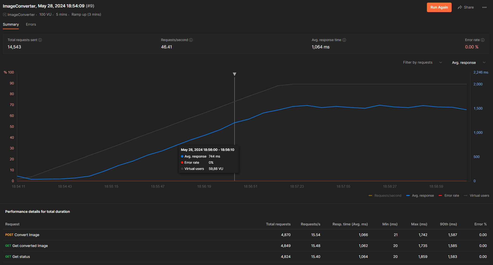
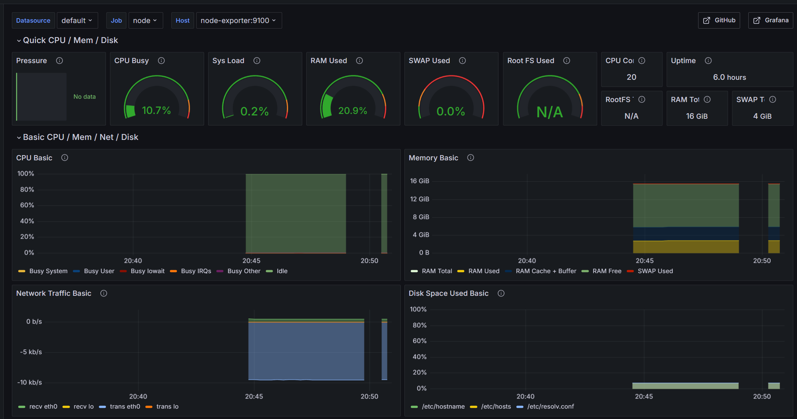

# НИЯУ МИФИ. Лабораторные работы №1-3 Нестеренко Виталий, Б21-525. 2024

## Предметная область

Система конвертации форматов изображений

### Процесс взаимодействия

1) Пользователь загружает изображение на веб-страницу, выбирает желаемый формат конвертации (например, из PNG в JPG)  и отправляет запрос через веб-форму
2) Сервис принимает запрос, сохраняет изображение в бд и добавляет задачу на конвертацию в брокер сообщений
3) Сервис обработки изображений читает задачи из очереди, выполняет конвертацию изображений в заданный формат и сохраняет сконвертированное изображение в бд
4) Пользователь может проверить статус запрос, используя уникальный идентификатор задачи. После завершения обработки пользователь получает ссылку для скачивания сконвертированного изображения

### Параметры работы системы

- Стандартная интенсивность трафика составляет 30 RPS
- В периоды пиковых нагрузок интенсивность может достигать 100 RPS

### Технологический стек

- FastAPI - бэкенд
- PostgreSQL - СУБД
- Redis - брокер сообщений и хранилище кэша
- Grafana - визуализация метрик
- Prometheus - сбор и аналитика метрик
- Node Exporter - сбор системных метрик

Выбор Redis обусловлен его простой настройкой и способностью эффективно управлять очередями обработки без избыточной сложности.

## Развертывание

### Подготовка среды

1. Скопировать файл `deploy/.env.sample` в файл `deploy/.env` и поменять секретные значения:
   ```bash
   cp deploy/.env.sample deploy/.env
   ```

### Запуск сервисов

1. Запустить контейнеры:
   ```bash
   chmod +x start.sh
   ./start.sh
   ```

## Нагрузочное тестирование

### Принцип тестирования

Для выполнения нагрузочного тестирования был выбран инструмент Postman. Тест длился в течение пяти минут. В первые три минуты быд линейный рост числа пользователей с нуля до ста. После этого количество пользователей оставалось на уровне ста до окончания тестирования.

### Результаты тестирования



На графике видно, что система функционировала без ошибок. Однако, когда количество пользователей достигло отметки в 100 человек, время ответа увеличилось до 1500 мс, что является довольно высоким показателем. Для уменьшения времени ответа планируется внедрение кэширования, которое будет реализовано далее.

### Мониторинг



В проект был внедрён мониторинг системных ресурсов с использованием Prometheus, Node Exporter и Grafana. Prometheus собирает метрики с различных узлов, используя Node Exporter для отслеживания их состояния. Grafana, в свою очередь, предоставляет визуализацию данных, позволяя наглядно представить и анализировать собранные метрики.

### Кэширование

Кэширование эндпоинта для получения статуса было успешно внедрено с использованием Redis. В результате проведённого нагрузочного тестирования было установлено, что среднее время ответа на запрос сократилось на 33%, уменьшившись с 1500 мс до 1000 мс. Это значительное улучшение производительности демонстрирует эффективность внедрённого кэширования.


## Заключение

В рамках выполненной работы была успешно разработана система для конвертации форматов изображений, состоящая из двух основных компонентов: API сервера и сервиса обработки изображений. Для организации взаимодействия между компонентами был использован брокер сообщений Redis, что позволило значительно повысить надежность и пропускную способность системы. Эффективность данного подхода была подтверждена результатами нагрузочного тестирования. Несмотря на пиковую нагрузку в 100 запросов в секунду, система продемонстрировала стабильную работу без ошибок, обеспечивая при этом быструю обработку запросов.